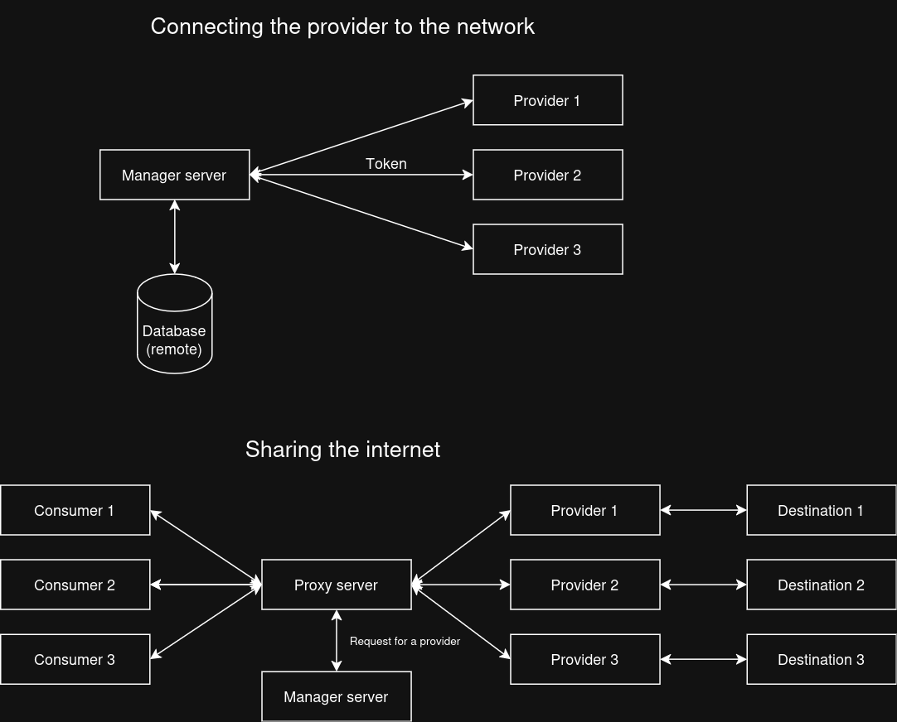

    

    FlowMesh is a high-performance forwarding proxy service written in Rust. It leverages the <a href="https://tokio.rs/">Tokio</a> library for asynchronous I/O operations.

## Design

## Contributing
Contributions are welcome! Please open an issue or submit a pull request on [GitHub](https://github.com/monosense/flowmesh).

### License
This project is distributed under the MIT License. Please refer to the [License](./LICENSE) file for more information.